<!--
 * @Author: Xuan Wen
 * @Date: 2021-02-22 16:58:15
 * @LastEditTime: 2021-03-30 16:47:02
 * @LastEditors: Please set LastEditors
 * @Description: In User Settings Edit
 * @FilePath: /rnn_sc_wc/README.md
-->
# RNN_SC_WC
---
#### 2021/03/30 update
Representitive Similarity Analysis (for CNN model now)
- Test images
- Train two models
- Generate RSA figures (based on absolute difference between two predicted results)

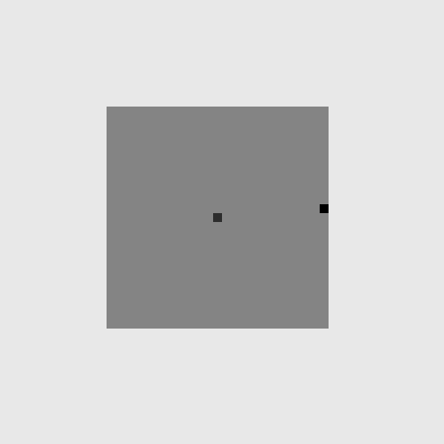
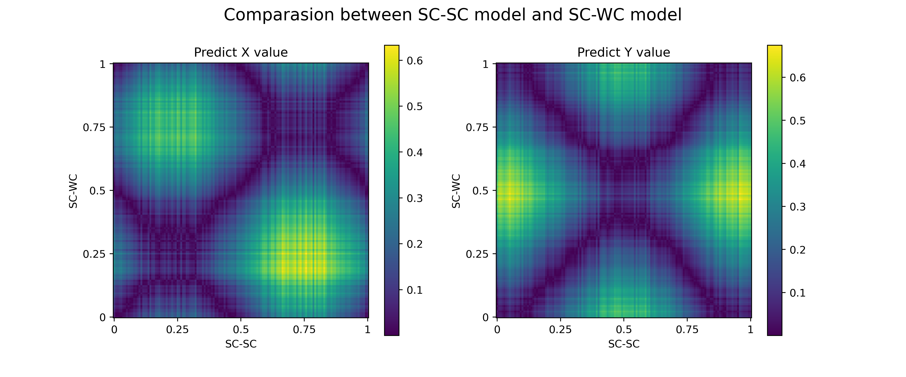
---
##  Input Image Generator
> Green Dot = Start poke, 0.7   
> Yellow Dot = Target poke, 1   
> Blue Dot = Noise (other poke), 0.2   
> Background, 0   
> Number of noise: 5
#### Self-centered 
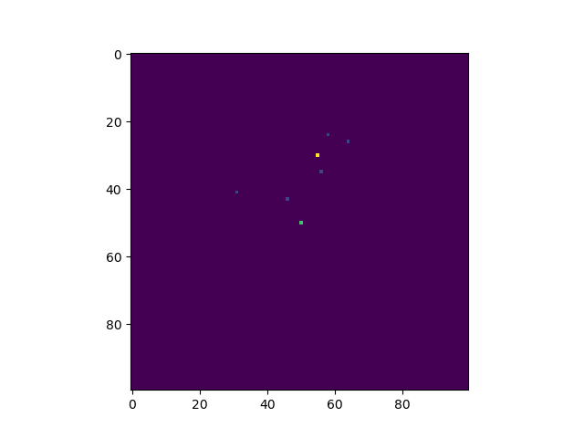
#### World-centered 

## CNN training result:
> Same training set and testing set for all conditions    
> 5000 training images, 500 testing images, 5 epoches
#### WC->WC
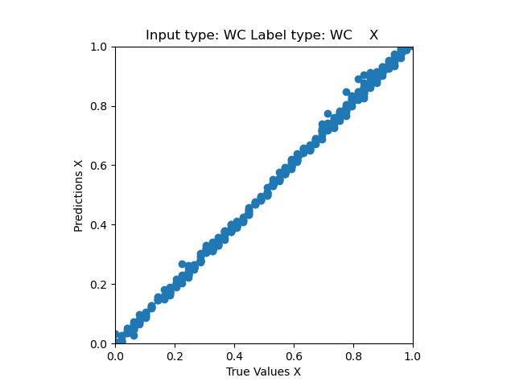
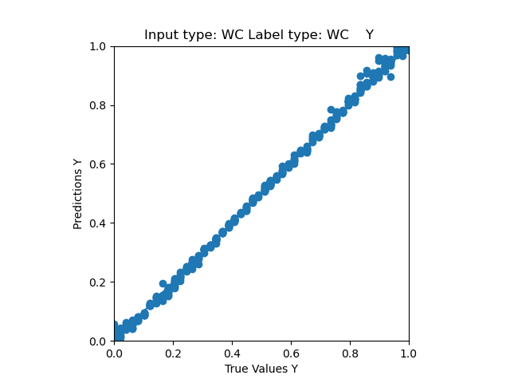

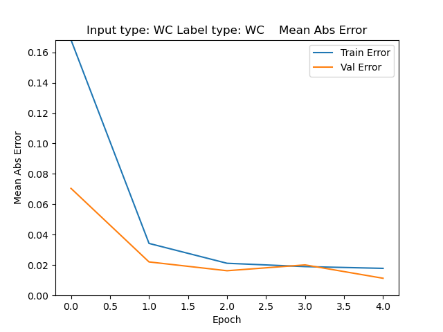

#### WC->SC
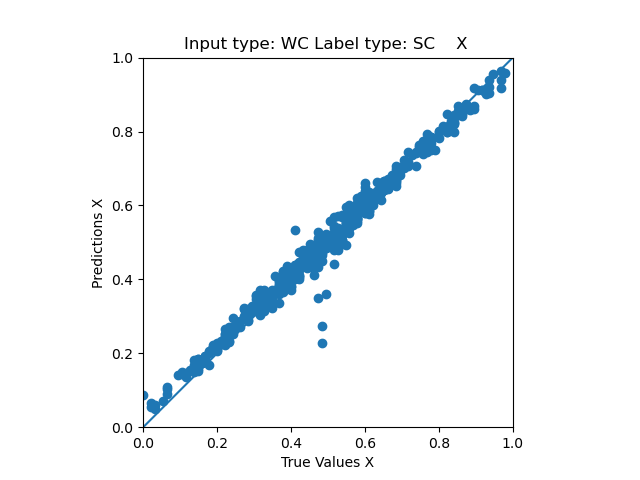

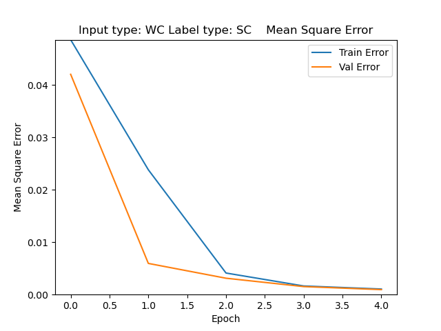
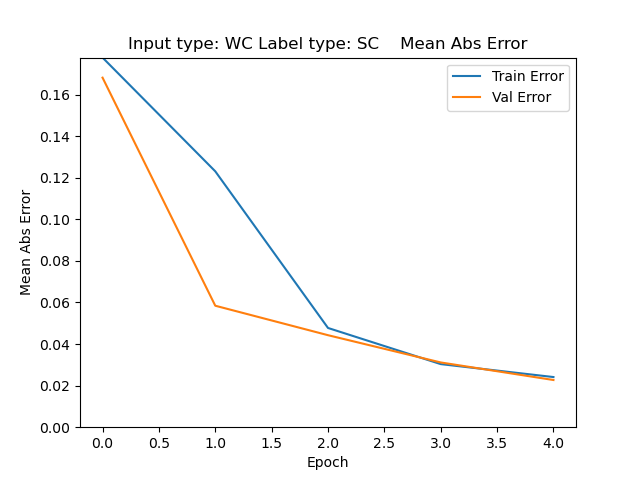

#### SC->WC
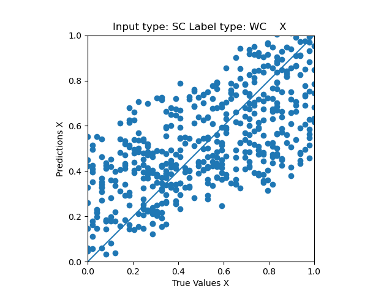

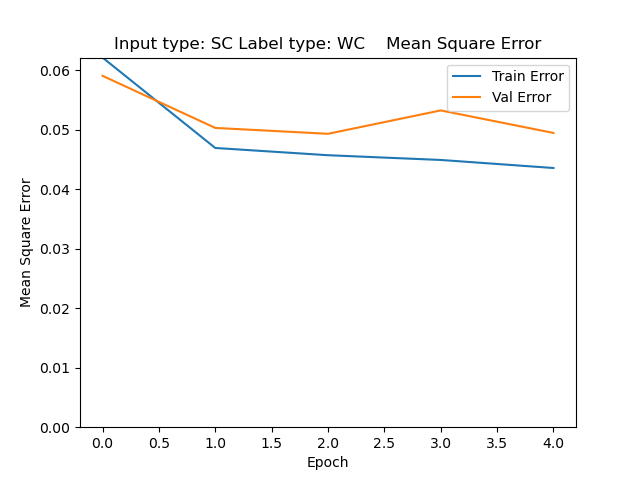
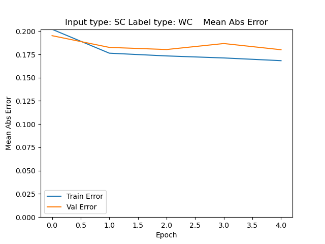

#### SC->SC

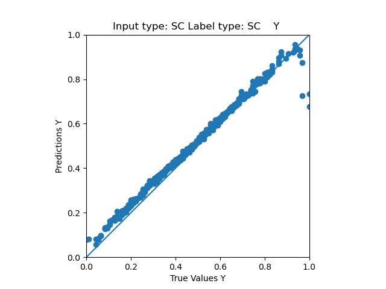
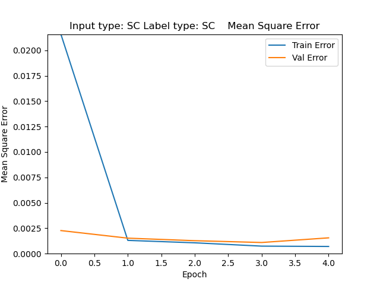
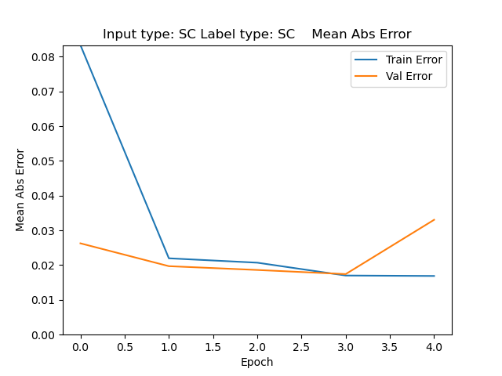

With the same amount of training, `SC -> WC` gives the worst prediction, which is because it has to learn the distance from `center` to `target poke`, and `center` is not shown on the input image. Following graphs show the `SC->WC` condition with more training epoch.

#### SC->WC with 10 training epoch
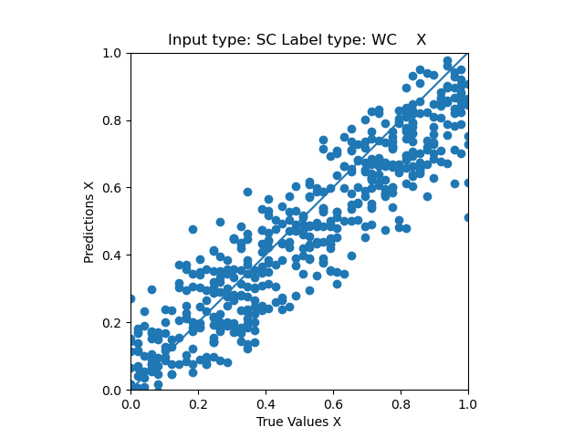
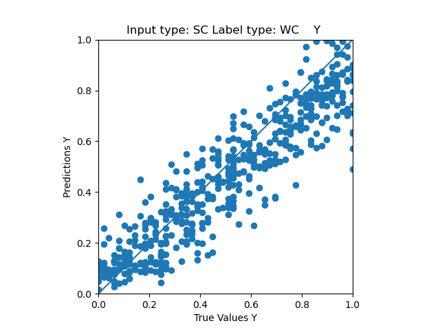
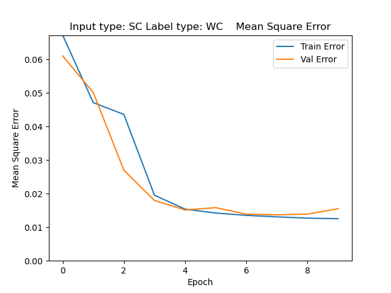
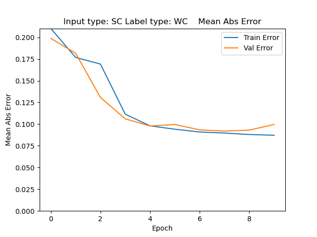

Training errors are saturated after 8th epoch, and the predictions are still worse than other 3 conditions.

#### SC->WC with 20 training epoch and more activation layer
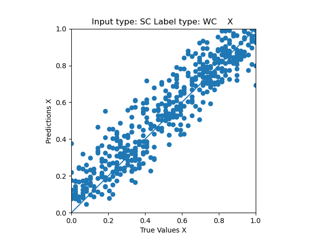
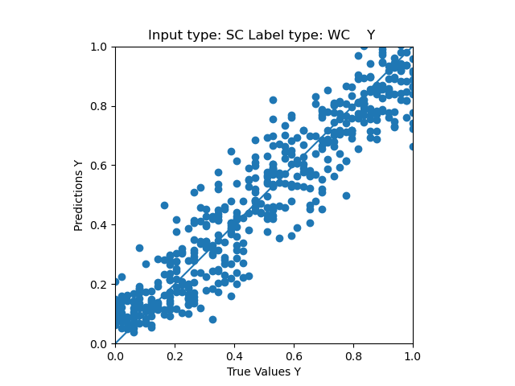
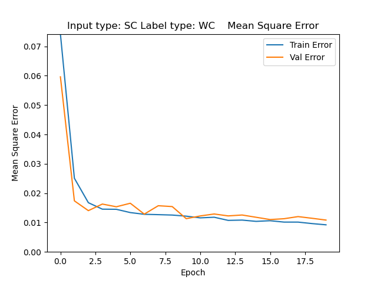
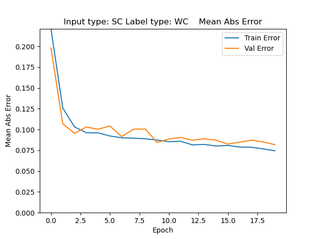

---

Why does SC -> WC perform much worse than other three conditions?    
**I don't know, computer science is too hard for me**

---
### Improvements:   
Change the representation of pokes from `1x1` to `2x2`:

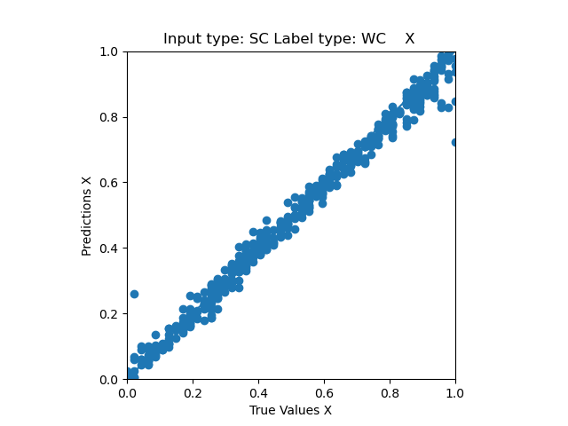
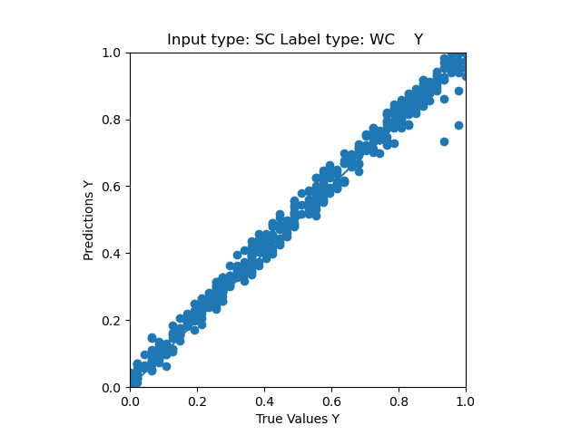
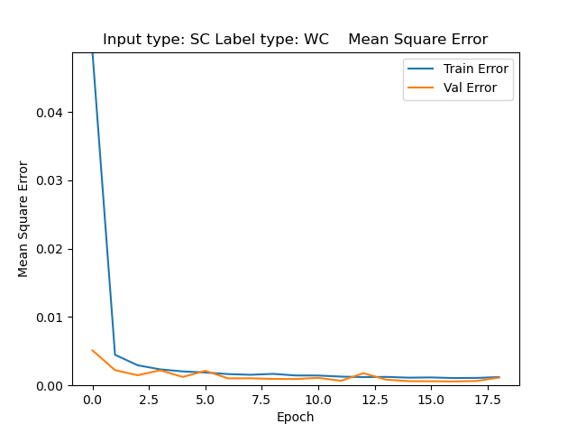
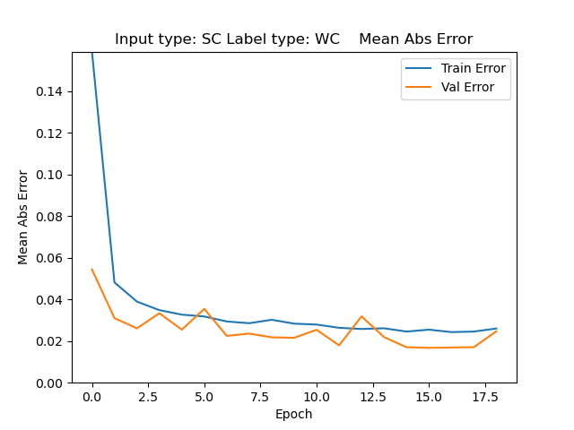

it gets much better, probably because information of one pixel gets deluted during the covolution layers? I'm not sure why other three conditions were not affected.

